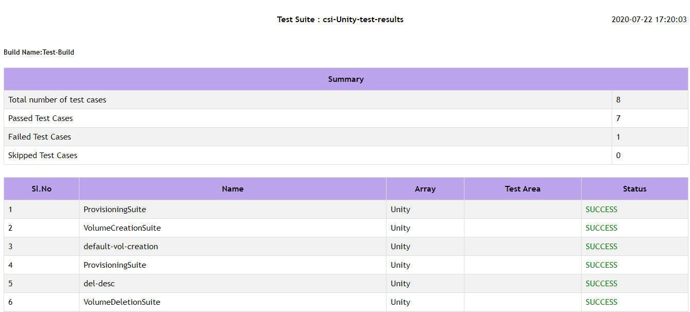
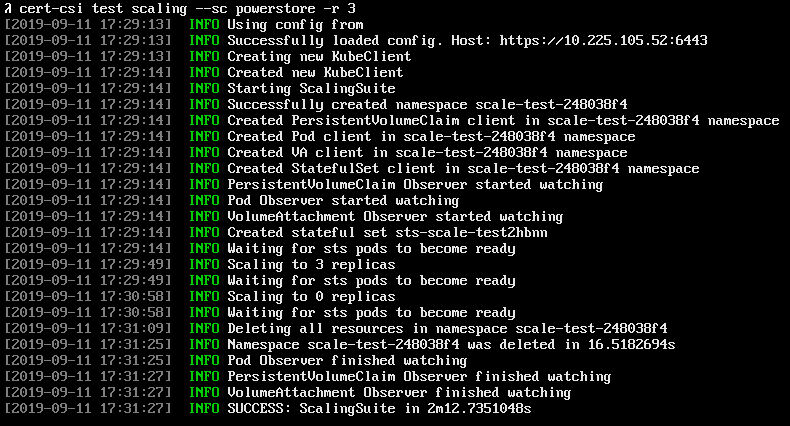
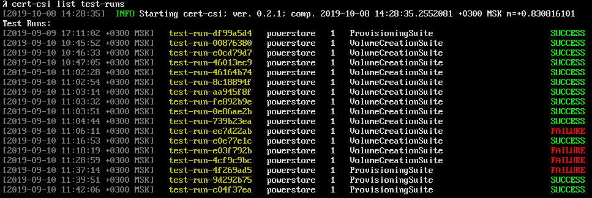
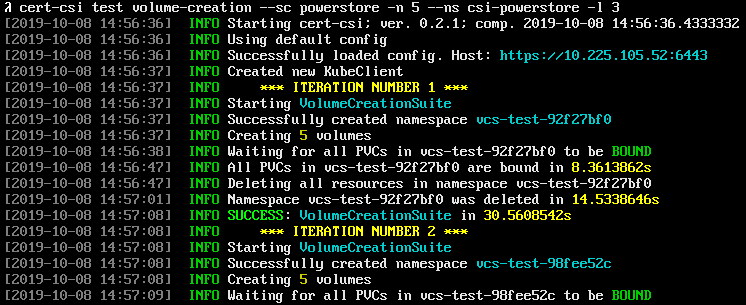
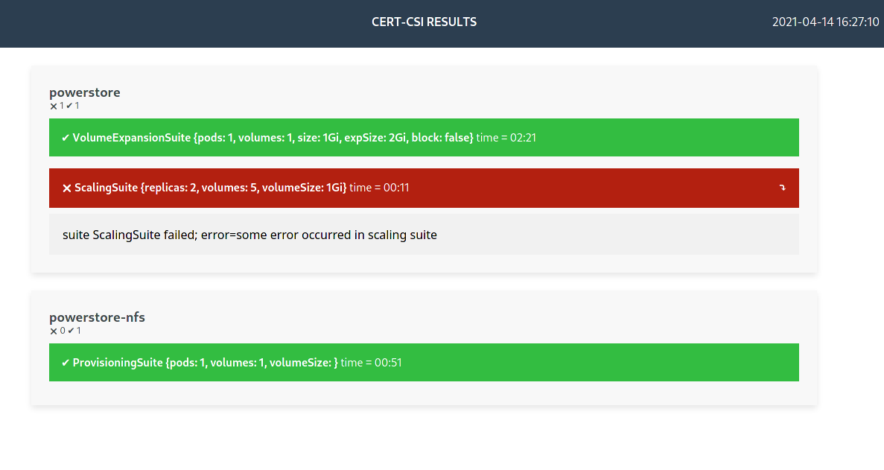
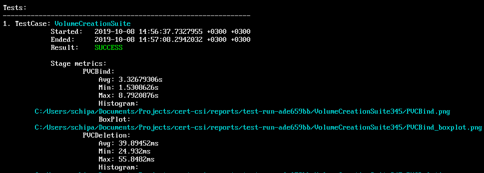
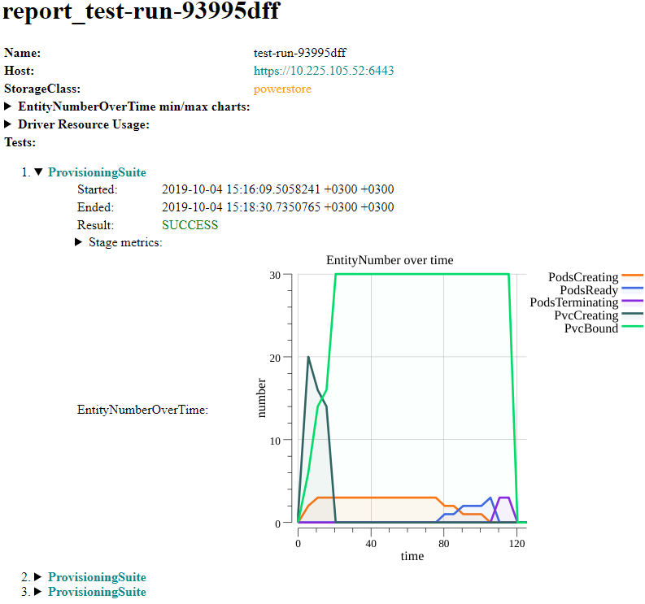
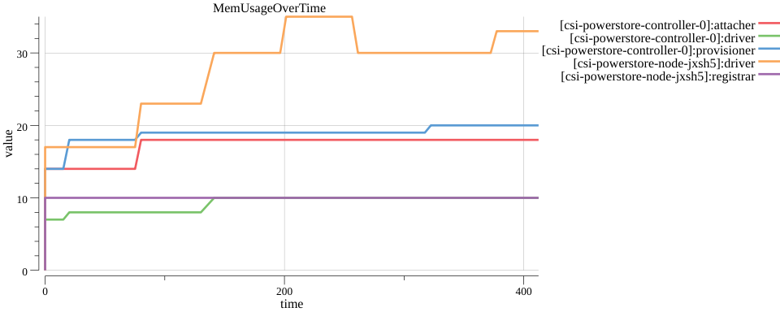

<!--
Copyright © 2022-2023 Dell Inc., or its subsidiaries. All Rights Reserved.

Licensed under the Apache License, Version 2.0 (the "License");
you may not use this file except in compliance with the License.
You may obtain a copy of the License at
   
    http://www.apache.org/licenses/LICENSE-2.0

Unless required by applicable law or agreed to in writing, software
distributed under the License is distributed on an "AS IS" BASIS,
WITHOUT WARRANTIES OR CONDITIONS OF ANY KIND, either express or implied.
See the License for the specific language governing permissions and
limitations under the License.
-->
# Getting Started Guide

<!--ts-->
   * [CERT-CSI: Test tool for CSI Drivers](#cert-csi-test-tool-for-csi-drivers)
      * [Installing](#installing)
      * [How to Run](#how-to-run)
      * [Driver Certification](#driver-certification)
         * [Preparing Config](#preparing-config)
         * [Launching Certification Test Run](#launching-certification-test-run)
      * [Functional Tests](#functional-tests)
         * [Running Individual Suites](#running-individual-suites)
            * [Volume/PVC Creation](#volumepvc-creation)
            * [Provisioning/Pod creation](#provisioningpod-creation)
            * [Running Volume Deletion suite](#running-volume-deletion-suite)
            * [Running Pod Deletion suite](#running-pod-deletion-suite)
            * [Running Cloned Volume deletion suite](#running-cloned-volume-deletion-suite)
            * [Multi Attach Volume Tests](#multi-attach-volume-tests)
            * [Ephemeral volumes suite](#ephemeral-volumes-suite)
            * [Storage Capacity Tracking Suite](#storage-capacity-tracking-suite)
         * [Other Options](#other-options)
            * [Generating tabular report from DB](#generating-tabular-report-from-db)
            * [Generating XML report from DB](#generating-xml-report-from-db)
            * [Including Array configuration file](#including-array-configuration-file)
         * [Screenshots](#screenshots)
      * [Kubernetes End-To-End Tests](#kubernetes-end-to-end-tests)
         * [Running Kubernetes End-To-End Tests](#running-kubernetes-end-to-end-tests)
         * [Kubernetes end-to-end reporting](#kubernetes-end-to-end-reporting)
         * [Test config files format](#test-config-files-format)
         * [Example Commands](#example-commands)
      * [Performance Tests](#performance-tests)
         * [Running Individual Suites](#running-individual-suites-1)
            * [Running Volume Creation test suite](#running-volume-creation-test-suite)
            * [Running Provisioning test suite](#running-provisioning-test-suite)
            * [Running Scalability test suite](#running-scalability-test-suite)
            * [Running VolumeIO test suite](#running-volumeio-test-suite)
            * [Running Snap test suite](#running-snap-test-suite)
            * [Running MultiAttachVol suite](#running-multiattachvol-suite)
            * [Running Replication test suite](#running-replication-test-suite)
            * [Running Volume Cloning test suite](#running-volume-cloning-test-suite)
            * [Running Volume Expansion test suite](#running-volume-expansion-test-suite)
            * [Running Blocksnap suite](#running-blocksnap-suite)
         * [Running Longevity mode](#running-longevity-mode)
         * [Interacting with DB](#interacting-with-db)
            * [Generating report from runs without running tests](#generating-report-from-runs-without-running-tests)
            * [Customizing report folder](#customizing-report-folder)
            * [Generating report from multiple databases and test runs](#generating-report-from-multiple-databases-and-test-runs)
            * [Listing all known test runs](#listing-all-known-test-runs)
         * [Other options](#other-options-1)
            * [Customizing report folder](#customizing-report-folder-1)
            * [Running with enabled driver resource usage metrics](#running-with-enabled-driver-resource-usage-metrics)
            * [Running custom hooks from program](#running-custom-hooks-from-program)
         * [Screenshots](#screenshots-1)

<!-- Added by: andrew, at: Wed 14 Apr 2021 04:31:27 PM MSK -->

<!--te-->

## Installing
To install this tool you can download one of binary files located in [RELEASES](https://github.com/dell/cert-csi/releases)

Also you can build tool yourself by cloning repository and running
```bash
make build 
```

Also you can build a docker container
```bash
docker build -t cert-csi --build-arg username=user --build-arg password=qwerty . 
```

If you want to collect resource usage metrics of csi-driver please provide
namespace where it can be found and install metric-server like so _(kubectl is needed)_

```bash
make install-ms
```
[FOR UNIX] If you want to build and install the tool to your $PATH and enable the **auto-completion** feature:

```bash
make install-nix
```
> Alternatively you can use instruction from https://github.com/kubernetes-incubator/metrics-server

## How to Run

To get information on how to use program you can use built-in help. 

Or if you're using UNIX-like system and enabled _auto-completion feature_ while installing the tool, then you can use shell's
built-in auto-completion to navigate through program's subcommands and flags interactively by just pressing TAB.

Also, if your environment is pointed to any kube cluster (which is required to run cert-csi), 
then you will also receive dynamically formatted suggestion right from your cluster.
For example if you press TAB while passing --storageclass (or --sc) argument, 
the tool will parse all existing Storage Classes from your cluster and suggest them as an input for you. 

Example: 


> To run a docker container your command should look something like this
> `docker run --rm -it -v ~/.kube/config:/root/.kube/config -v $(pwd):/app/cert-csi cert-csi <usual program arguments>`

## Driver Certification 

You can use cert-csi to launch a certification test run against multiple storage classes to check if the driver adheres to advertised capabilities. 

### Preparing Config

To run the certification test you need to provide `.yaml` config with storage classes and their capabilities. You can use `example-certify-config.yaml` as an example. 

Example:
```yaml
storageClasses:
  - name: # storage-class-name (ex. powerstore)
    minSize: # minimal size for your sc (ex. 1Gi)
    rawBlock: # is Raw Block supported (true or false)
    expansion: # is volume expansion supported (true or false)
    clone: # is volume cloning supported (true or false)
    snapshot: # is volume snapshotting supported (true or false)
    RWX: # is ReadWriteMany volume access mode supported for non RawBlock volumes (true or false)
    ephemeral: # if exists, then run EphemeralVolumeSuite
      driver: # driver name for EphemeralVolumeSuite
      fstype: # fstype for EphemeralVolumeSuite
      volumeAttributes: # volume attrs for EphemeralVolumeSuite. 
        attr1: # volume attr for EphemeralVolumeSuite
        attr2: # volume attr for EphemeralVolumeSuite
```

### Launching Certification Test Run

After preparing certification configuration file you can launch certification by running 
```bash
cert-csi certify --cert-config <path-to-config>
Optional Params:
   --vsc: volume snapshot class, required if you specified snapshot capability
   --timeout: set the timeout value for certification suites
   --no-metrics: disables metrics aggregation (set if you encounter k8s performance issues)
   --path: path to folder where reports will be created (if not specified ~/.cert-csi/ will be used)
```

## Functional Tests

### Running Individual Suites
#### Volume/PVC Creation

```bash
cert-csi functional-test volume-creation --sc <storage class> -n 5
Optional Params:
--custom-name : To give custom name for PVC while creating only 1 PVC
--size : To give custom size, possible values for size in Gi/Mi
--access-mode : To set custom access-modes, possible values - ReadWriteOnce,ReadOnlyMany and ReadWriteMany
--block : To create raw block volumes
```

#### Provisioning/Pod creation

```bash
cert-csi functional-test provisioning --sc <storage class>
Optional Params:
--volumeNumber : number of volumes to attach to each pod 
--podNumber : number of pod to create
--podName : To give custom name for pod while creating only 1 pod
--block : To create raw block volumes and attach it to pods
--vol-access-mode: To set volume access modes 
```

#### Running Volume Deletion suite

```bash
cert-csi functional-test volume-deletion
--pvc-name value : PVC name to delete
--pvc-namespace : PVC namespace where PVC is present
```

#### Running Pod Deletion suite

```bash
cert-csi functional-test pod-deletion
--pod-name : Pod name to delete
--pod-namespace : Pod namespace where pod is present
```

#### Running Cloned Volume deletion suite

```bash
cert-csi functional-test clone-volume-deletion
--clone-volume-name : Volume name to delete
```

#### Multi Attach Volume Tests

```bash
cert-csi functional-test multi-attach-vol --sc <storage-class>
--pods : Number of pods to create
--block : To create raw block volume 
```

#### Ephemeral volumes suite

```bash
cert-csi functional-test ephemeral-volume --driver <driver-name> --attr ephemeral-config.properties
--pods : Number of pods to create 
--pod-name : To create pods with custom name
--attr : CSI volume attributes file name
--fs-type: FS Type can be specified

Sample ephemeral-config.properties (key/value pair)
arrayId=arr1
protocol=iSCSI
size=5Gi
```

#### Storage Capacity Tracking Suite

```bash
cert-csi functional-test capacity-tracking --sc <storage-class> --drns <driver-namespace> --pi <poll-interval>
Optional Params:
--vs : volume size to be created
```

### Other Options

#### Generating tabular report from DB

```bash
cert-csi -db <db_path> functional-report -tabular
Example: cert-csi -db ./test.db functional-report -tabular
Note: DB is mandatory parameter
```

#### Generating XML report from DB

```bash
cert-csi -db <db_path> functional-report -xml
Example: cert-csi -db ./test.db functional-report -xml
Note: DB is mandatory parameter
```

#### Including Array configuration file 

```bash
# Array properties sample (array-config.properties)
arrayIPs: 192.168.1.44
name: Unity
user: root
password: test-password
arrayIds: arr-1
```

### Screenshots

Tabular Report example




## Kubernetes End-To-End Tests
All Kubernetes end to end tests require that you provide the driver config based on the storage class you want to test and the version of the kubernetes you want to test against. These are the mandatory parameters that you can provide in command like..
` --driver-config <path of driver config file> and --version "v1.25.0" `

### Running kubernetes end-to-end tests

```bash
cert-csi k8s-e2e --config <kube config> --driver-config <path to driver config>  --focus <regx pattern to focus Ex: "External.Storage.*" >  --timeout <timeout Ex: "2h"> --version < version of k8s Ex: "v1.25.0"> --skip-tests <skip these steps mentioned in file> --skip <regx pattern to skip tests Ex:"Generic Ephemeral-volume|(block volmode)">
```

### Kubernetes end-to-end reporting
- All the reports generated by kubernetes end-to-end tests will be under `$HOME/reports` directory by default if user doesn't mention the report path
- kubernetes end to end tests Execution log file will be placed under $HOME/reports/execution_[storage class name].log
- cert-csi logs will be present in the execution directory `info.log` , `error.log`

### Test config files format
- #### [driver-config](../pkg/utils/testdata/config-nfs.yaml)
- #### [ignore-tests](../pkg/utils/ignore.yaml)

### Example Commands
-  ```bash
   cert-csi k8s-e2e --config "/root/.kube/config" --driver-config "/root/e2e_config/config-nfs.yaml"  --focus "External.Storage.*"  --timeout "2h" --version "v1.25.0" --skip-tests "/root/e2e_config/ignore.yaml"
   ```
-  ```bash
   ./cert-csi k8s-e2e --config "/root/.kube/config" --driver-config "/root/e2e_config/config-iscsi.yaml" --focus "External.Storage.*"  --timeout "2h" --version "v1.25.0" --focus-file "capacity.go"
   ```

## Performance Tests

All performance tests require that you provide storage class that you want to test. You can provide multiple storage classes in one command like so `... --sc <sc1> --sc <sc2> ...`

### Running Individual Suites 
#### Running Volume Creation test suite

```bash
cert-csi test volume-creation --sc <storage class> -n 25
```

#### Running Provisioning test suite

```bash
cert-csi test provisioning --sc <storage class> --podNum 1 --volNum 10
```

#### Running Scalability test suite

```bash
cert-csi test scaling --sc <storage class> --replicas 5
```

#### Running VolumeIO test suite

```bash
cert-csi test vio --sc <storage class> --chainNumber 5 --chainLength 20
```

#### Running Snap test suite

```bash
cert-csi test snap --sc <storage class> --vsc <volume snapshot class> 
```

#### Running MultiAttachVol suite

```bash
cert-csi test multi-attach-vol --sc <storage class> --podNum 3
```
```bash
cert-csi test multi-attach-vol --sc <storage class> --podNum 3 --block # to use raw block volumes
```

#### Running Replication test suite

```bash
cert-csi test replication --sc <storage class> --pn 1 --vn 5 --vsc <snapshot class> 
```

#### Running Volume Cloning test suite

```bash
cert-csi test clone-volume --sc <storage class> --pn 1 --vn 5
```

#### Running Volume Expansion test suite

```bash
cert-csi test expansion --sc <storage class> --pn 1 --vn 5 --iSize 8Gi --expSize 16Gi

cert-csi test expansion --sc <storage class> --pn 1 --vn 5 # `iSize` and `expSize` default to 3Gi and 6Gi respectively

cert-csi test expansion --sc <storage class> --pn 1 --vn 5 --block # to create block volumes
```

#### Running Blocksnap suite

```bash
cert-csi test blocksnap --sc <storageClass> --vsc <snapshotclass>
```

### Running Longevity mode

```bash
cert-csi test <any of previous tests> --sc <storage class> --longevity <number of iterations>
```

### Interacting with DB 

#### Generating report from runs without running tests

```bash
cert-csi --db <path/to/.db> report --testrun <test-run-name> --html --txt
Report types:
--html: performance html report
--txt: performance txt report
--xml: junit compatible xml report, contains basic run infomation
--tabular: tidy html report with basic run information
```

#### Customizing report folder
```bash
cert-csi --db <path/to/.db> report --testrun <test-run-name> --path <path-to-folder>
Options:
--path: path to folder where reports will be created (if not specified `~/.cert-csi/` will be used)
```

#### Generating report from multiple databases and test runs

```bash
cert-csi report --tr <db-path>:<test-run-name> --tr ... --tabular --xml
Supported report types: 
--xml
--tabular
```

#### Listing all known test runs

```bash
cert-csi --db <path/to/.db> list test-runs
```

### Other options

#### Customizing report folder
```bash
cert-csi <command> --path <path-to-folder>
Commands:
    test <any-subcommand>
    certify
    report
```

#### Running with enabled driver resource usage metrics

```bash
cert-csi test <test suite> --sc <storage class> <...> --ns <driver namespace> 
```

#### Running custom hooks from program

```bash
cert-csi test <test suite> --sc <storage class> <...> --sh ./hooks/start.sh --rh ./hooks/ready.sh --fh ./hooks/finish.sh
```

### Screenshots 

Running provisioning test


You can interrupt the application by sending interruption signal (for example pressing Ctrl + C)
It will stop polling and try to cleanup resources.


Running scaling test



Listing available test runs



Running longevity mode



Multi DB Tabular report example



Text report example



HTML report example



Resource usage example chart

